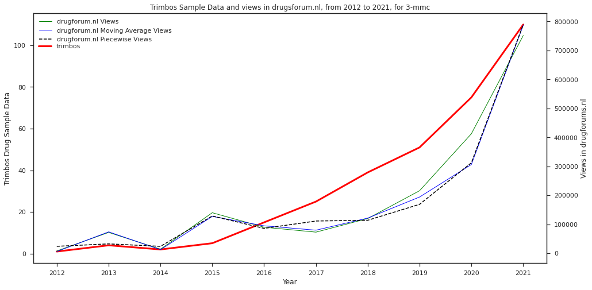
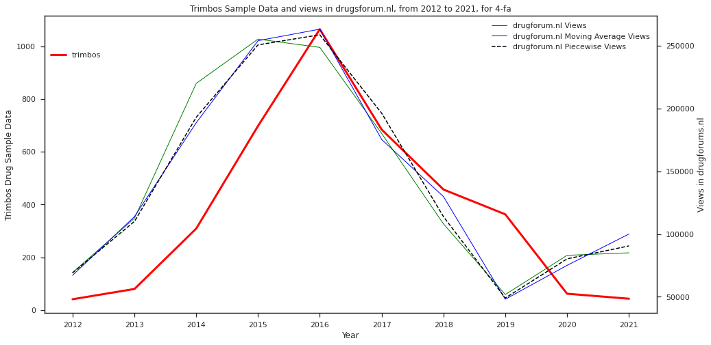

# Online Monitoring of New Psychoactive Substances: using Reddit and Drug Forums to determine popularity of NPS

## About
The emergence of new psychoactive substances (NPS) as a replacement for classical popular drugs has led to a growing public health and law enforcement challenge in the Netherlands. Monitoring trends of NPS popularity and rapid identification of new upcoming NPS could add value to predictive policing methods.

The main aim of this research is to compare the behaviour of drug popularity on online forums with real-life test sample data. Correlation of online popularity indicators with real-life test sample data obtained promising results for two out of three forums tested. A predictive system for flagging new upcoming popular NPS is suggested using the best performing popularity indicator.

This research is a prototype for detection of NPS using online indicators. For more accurate predictions, more ground-truth data is required to fine-tune the system.

## Directory Structure

```
├── code
│   ├── analysis
│   │   ├── drugsforum.ipynb
│   │   ├── images
│   │   ├── timeseries
│   │   └── timeseries_info
│   ├── dashboard
│   │   ├── search_nl.ipynb
│   │   └── search_nl.py
│   └── scrapers
│       ├── forums
│       ├── newspapers
│       ├── vendors
│       └── wiki
├── corpus
│   ├── forums
│   │   ├── drugsforumInfo
│   │   └── drugsforumNL
│   ├── trimbos
│   │   ├── trimbos_data.csv
│   │   ├── trimbos_survey.csv
│   │   └── trimbos_survey.ods
│   └── wiki
│       └── psychonautwiki.txt
└── readme.md
```

## Methodology

### Data Collection
Custom scrapers are created from Drugsforum.info and Drugsforum.nl. These scrapers collect the following information about threads posted on these sites: thread title, comments on the threads, and views for each thread. These datasets are stored in CSV files.

Reddit API is used to scrape information from subreddits about drugs. In addition to thread title and comments, upvotes are per thread/comment are stored.

To compare online results with real-life data, data collected by the Trimbos institute is used. This data has been combined from annual reports released by the Trimbos institute, where number of occurrences of drugs in lab tests is released for 5 frequent drugs (2C-B, 3-MMC, 4-MMC, 4-FA, and 4-FMA).

Source files for data collection can be found in scrapers/forums. All datasets are present in corpus/forums and corpus/trimbos.

### Data Aggregation

To quantify the popularity of particular drugs (say D) in online drug forums, the concept of popularity indicators is introduced.

First, threads mentioning D (and its known synonyms) are filtered. Then, the indicators (see table below) are combined for each month to create a timeseries for each indicator.

|Forum|Popularity Indicator|
|-----|------|
|Reddit|Mentions, Comments, Upvotes|
|Drugsforum.nl|Mentions, Comments, Views|
|Drugsforum.info|Mentions, Comments, Views|

Timeseries datasets can be found in analysis/timseries and analysis/timseries_info.

### Statistical Analysis
In order to reduce the impact of spikes in the online data, first a smoothing process is performed on popularity indicator timeseries. This is done in two separate ways: using an averaging filter per year, and by conducting piecewise linear regression with 12 breakpoints. To quantify the similarity between online values and Trimbos data, Pearson correlation is performed.

Notebook for analysis is analysis/drugsforum.ipynb.

### Results
Among the popularity metrics, number of views resulted in hightes average correlation with Trimbos lab data. The correlation values are presented int eh following table:

| NPS      | drugsforum.nl | Reddit |
| ----------- | ----------- | ---- |
|2C-B|0.58|0.79|
|3-MMC|0.92|0.89|
|4-MMC|0.69|0.69|
|4-FA|0.82|0.15|
|4-FMA|0.49|0.14|

Here is a graph presenting drugsforum.nl views vs Trimbos data for the drugs 3-MMC and 4-FA




All correlations for drugsforum.info were negative values, hence it is discarded from the consideration of best popularity indicators.

### Flagging System
Since views of drugsforum.nl have the highest average correlation, it is considered to be the metric for the flagging system.

The flagging system calculates the following drugs:
* with largest increase in the past 6 months
* with largest number of views in the past 3 months
* that have occurred newly in the past 3 months

Flagging system is present in dashboard.
